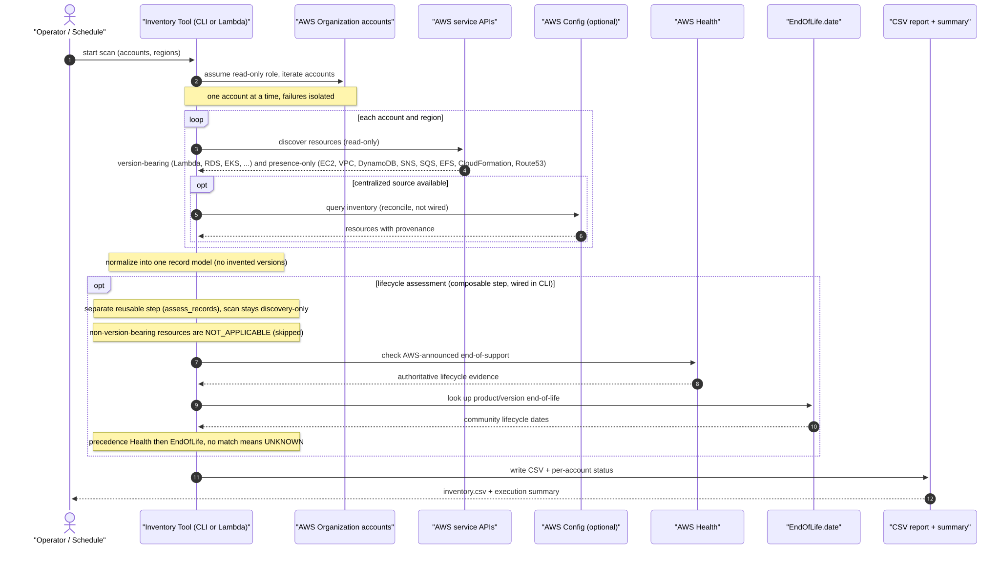

# AWS Resource Lifecycle Inventory Tool

Read-only AWS tool that discovers version-bearing AWS resources, normalizes their
software/runtime/engine versions, and produces a CSV report. See `AGENTS.md` and
`openspec/` for the full roadmap.

## Execution flow (org multi-account scan)

The diagram below is a **conceptual** sequence of an organization multi-account
scan: what the tool does, not every function it calls. It connects to the
organization, iterates accounts under a read-only role, discovers resources and
versions via AWS APIs (optionally reconciling with AWS Config), then evaluates
lifecycle against AWS Health and EndOfLife, and finally writes a CSV report.
Stages *implemented but not yet wired* into this path are marked `(not wired)`.

The rendered image is generated from the mermaid source at
[`docs/diagrams/execution-sequence.mmd`](docs/diagrams/execution-sequence.mmd)
(the source is the single point of truth). It is an SVG — **click it to open the
full-size, zoomable version**.

<!-- BEGIN: execution-sequence-diagram (image generated by the
     `update-execution-diagram` skill from docs/diagrams/execution-sequence.mmd
     — see AGENTS.md; do not hand-edit) -->

[](docs/diagrams/execution-sequence.svg)

<!-- END: execution-sequence-diagram -->

> Maintenance: this diagram is a documented requirement. The mermaid **source**
> (`docs/diagrams/execution-sequence.mmd`) is versioned; the **SVG** is a
> generated artifact. When you change the execution flow (triggers,
> orchestration, collectors, lifecycle wiring, output), regenerate both with the
> `update-execution-diagram` skill. A pre-commit hook reminds you when relevant
> source files change without updating the diagram.

## Install

```bash
python3 -m venv .venv
source .venv/bin/activate
pip install -e ".[dev]"
```

## Usage

```bash
aws-lifecycle-inventory --region us-east-1 --output inventory.csv
# or, with a named profile / AWS SSO
aws-lifecycle-inventory --profile my-profile --region us-east-1 --output inventory.csv
```

Authentication uses the standard boto3 credential chain. If `--profile` is
omitted, boto3 resolves credentials from environment variables, `AWS_PROFILE`,
AWS SSO, the shared credentials file, or an instance/container role. The tool only
issues read-only (`list`/`describe`) API calls.

### Required read-only IAM actions

```
sts:GetCallerIdentity
lambda:ListFunctions
rds:DescribeDBInstances
rds:DescribeDBClusters
elasticache:DescribeCacheClusters
elasticache:DescribeReplicationGroups
eks:ListClusters
eks:DescribeCluster
```

### Read-only IAM actions for general (non-version-bearing) inventory

```
ec2:DescribeInstances
ec2:DescribeVpcs
dynamodb:ListTables
sns:ListTopics
sqs:ListQueues
elasticfilesystem:DescribeFileSystems
cloudformation:DescribeStacks
cloudformation:ListStackSets
route53:ListHostedZones
```

## Development

```bash
python -m pytest -s
```

Tests use `moto` (`@mock_aws`) and never contact real AWS; dummy credentials are
set in the test fixtures.
